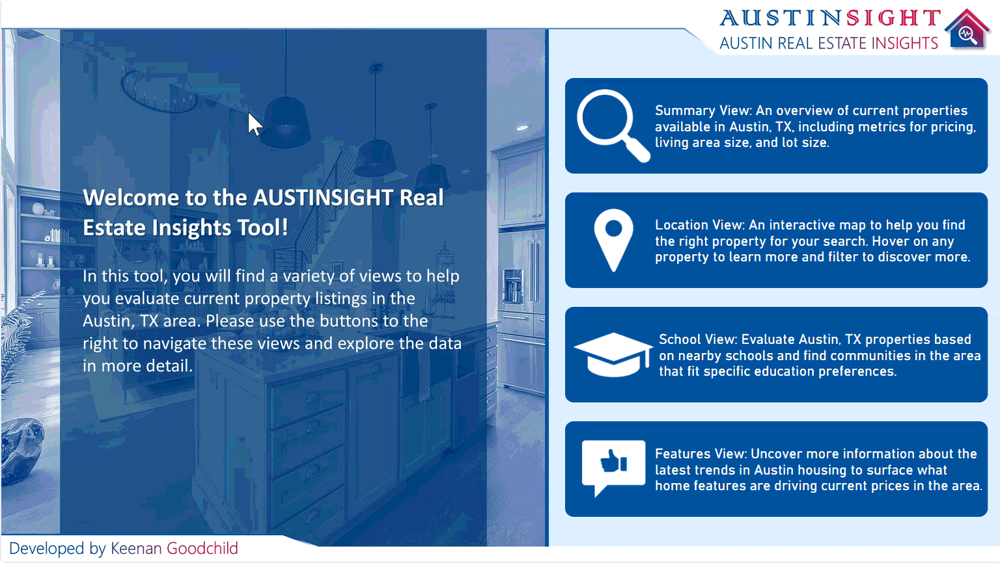
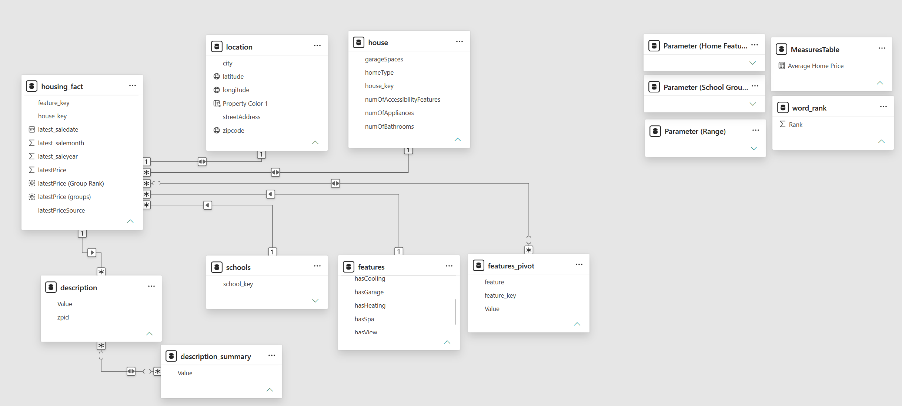

# Austin, TX Real Estate Insights Tool

## 🛠 Tools Used  

## 💡 Skills Demonstrated  

---

---

## 📊 Description  

This **professional Power BI tool** provides a variety of views to help the consumer evaluate 2020 property listings in the Austin, TX area, based on location, nearby schools, property features, and a plethora of other metrics.

 The dashboard is designed with multiple views:  
 - **Summary View** → An overview of properties available in Austin, TX, including metrics for pricing, living area size, and lot size.
 - **Location View** → An interactive map that lets you filter properties and hover over them to get additional information through tooltips.
 - **School View** → A view of nearby schools and find communities in the area that fit specific education preferences.
 - **Features View** → Uncover more information about the trends in Austin housing to surface what home features are driving current prices in the area.

This tool utilizes a **self-service design philosophy**, built with user-friendly web design principals that turns end-users from passive data viewers into **active, independent data investigators**.

### Check out the full published tool 

 

> *This tool was designed without the assistance of AI and features publicly available data from 2020.* 
> *This tool was created in July 2026.*

---

## 📸 Preview  

### Summary View  
  

### Location View

### School View

### Features View

---

## 📁 Data Model Structure

---

## 👩‍💻 Created By  

**Keenan Goodchild**  
- 📊 Microsoft Certified Excel Expert & Power BI Data Analyst | PCEP Certified Entry-Level Python Programmer
- 🌐 [LinkedIn Profile](https://www.linkedin.com/in/keenan-goodchild/)  
- 💼 Open to opportunities in **business intelligence, data analytics, and other data-related fields**

  <a href="../" style="text-decoration:none; font-size:22px;">
    ⬅️ <b>RETURN TO PORTFOLIO</b>
  </a>

