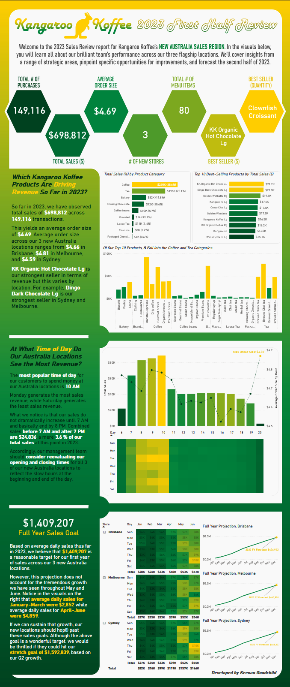
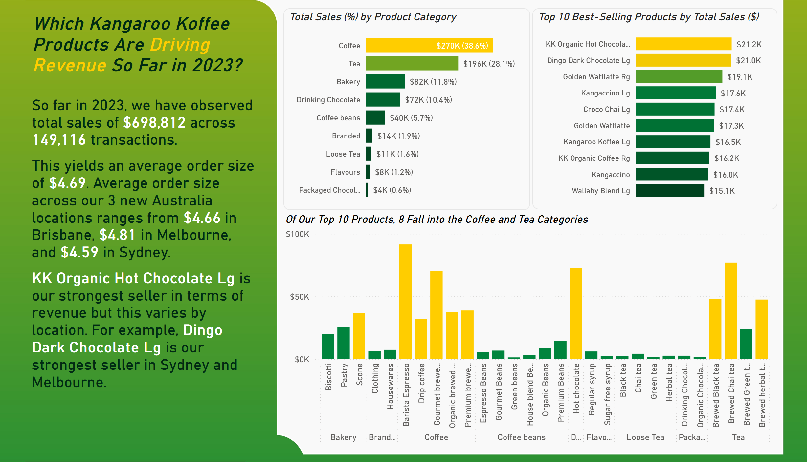
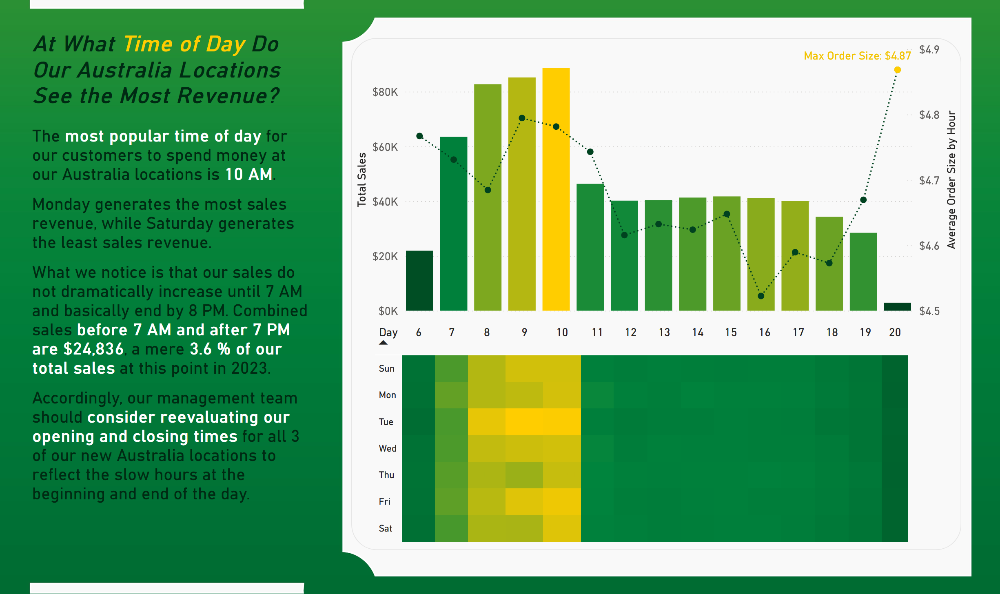
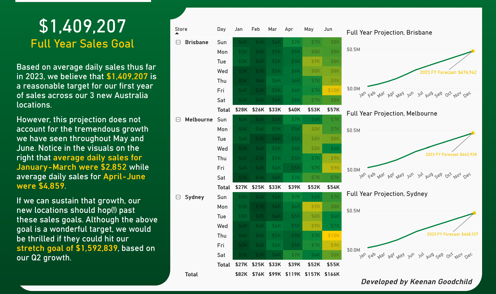
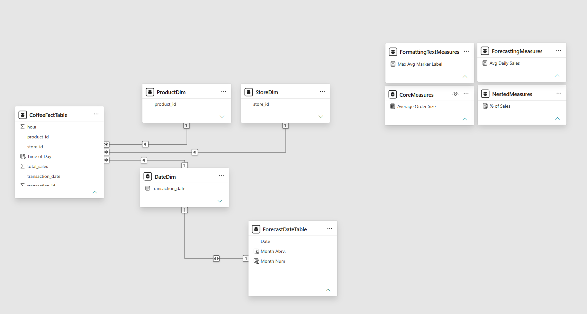

# Kangaroo Koffee Sales Infographic

## 🛠 Tools Used  

## 💡 Skills Demonstrated  

---

---

## 📊 Description  

This **professional Power BI infographic** provides a Q1/Q2 2023 high-level performance review of a coffee company's new sales region, covering insights from a range of strategic areas, pinpointing specific opportunities for improvements, and forecasting the remainder of 2023.

 This infographic is designed with summary metrics and three main segments:
 - **Insights** → Finds insights gained from sales across different product categories and which products drive revenue.
 - **Improvement Opportunities** → Looks at the revenue across time of day and day of the week to find a potential area for improvement.
 - **Forecast for Second Half 2023** → Sets a conservative sales goal and forecasts the second half of 2023, and gives a stretch goal based on Q2 growth.

  🔗 [Click here to interact with the published project →](https://app.powerbi.com/view?r=eyJrIjoiNGFiYjI5NjUtZDhiYS00NTczLThhMGUtNTRkYTUxN2NjNjE2IiwidCI6IjZmODFlZjFkLTlmYmQtNGMwYi05OGVkLWJhNWQ1MzA5YzQzMCJ9)
 

> *This infographic was designed for skill demonstration purposes, without the assistance of AI, and features a mock scenario using fictitious data.*  
> *This tool was created in July 2026.*

---

## 📸 Preview  

### Intro and Summary  
  

### First Half 2023 - Insights

### First Half 2023 - Improvement Opportunities

### Forecasting Second Half 2023

---

## 📁 Data Model Structure

---

## 👩‍💻 Created By  

**Keenan Goodchild**  
- 📊 Microsoft Certified Excel Expert & Power BI Data Analyst Associate | PCEP Certified Entry-Level Python Programmer
- 🌐 [Check out my LinkedIn Profile](https://www.linkedin.com/in/keenan-goodchild/)  
- 💼 Open to opportunities in **business intelligence, data analytics, and other data-related fields**

[Head Back to the Power BI Portfolio](https://github.com/KGGoodchild/PowerBI-Portfolio)

