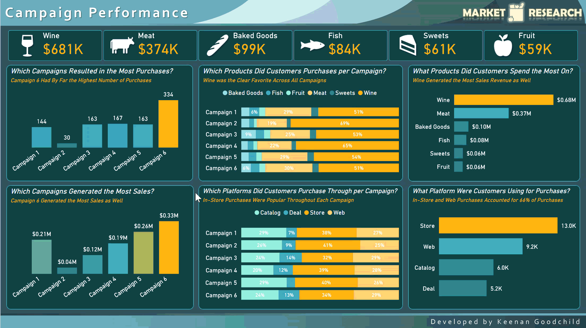
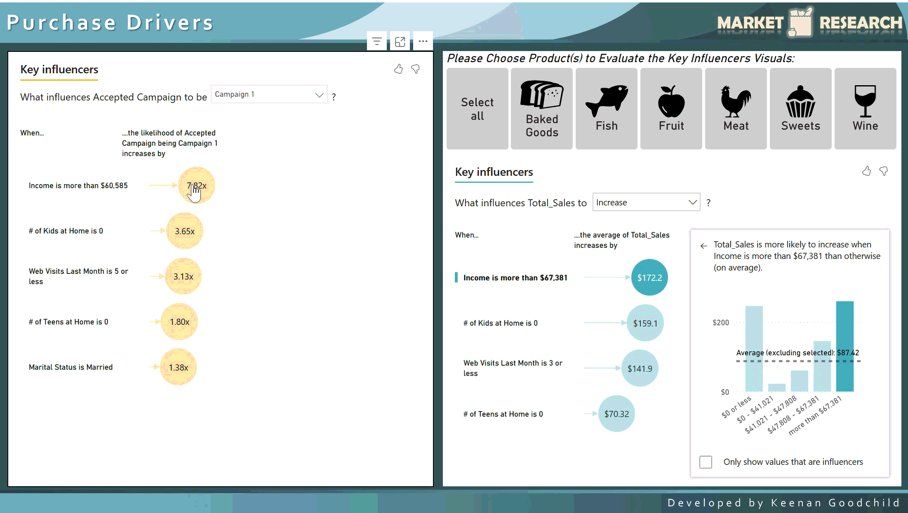
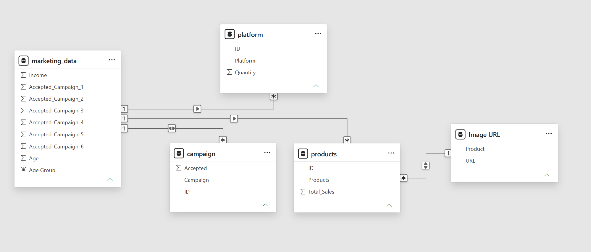

# Grocery Market Research Report

## 🛠 Tools Used  

## 💡 Skills Demonstrated  

---

---

## 📊 Description  

This **professional Power BI report** provides marketing research metrics that surfaces insights into a retail grocer's six most recent marketing campaigns, including a look at their customer's demographic information and specific key purchase drivers. The company's logo, color palette, and visual design were created from scratch for this project.

 This report is designed with three main focuses:
 - **Campaign Performance** → Metrics that look into the performance of the company's products and the six most recent marketing campaigns.
 - **Customer Demographics** → A deep dive into who are customers are, including education, martial status, salary, age, and more.
 - **Purchase Drivers** → Identifying what drives campaign performance and customer decision-making.

  🔗 [Click here to interact with the published project →](https://app.powerbi.com/view?r=eyJrIjoiODY4OTM1ZjctM2MxNi00ODgxLWE5YzgtNDQzYjJmN2JkZThiIiwidCI6IjZmODFlZjFkLTlmYmQtNGMwYi05OGVkLWJhNWQ1MzA5YzQzMCJ9)
 

> *This report was designed for skill demonstration purposes, without the assistance of AI, and features a mock scenario using fictitious data.*  
> *This tool was created in July 2026.*

---

## 📸 Preview  

### Campaign Performance  
  

### Customer Demographics

### Purchase Drivers

---

## 📁 Data Model Structure

---

## 👩‍💻 Created By  

**Keenan Goodchild**  
- 📊 Microsoft Certified Excel Expert & Power BI Data Analyst Associate | PCEP Certified Entry-Level Python Programmer
- 🌐 [Check out my LinkedIn Profile](https://www.linkedin.com/in/keenan-goodchild/)  
- 💼 Open to opportunities in **business intelligence, data analytics, and other data-related fields**

[Head Back to the Power BI Portfolio](https://github.com/KGGoodchild/PowerBI-Portfolio)
