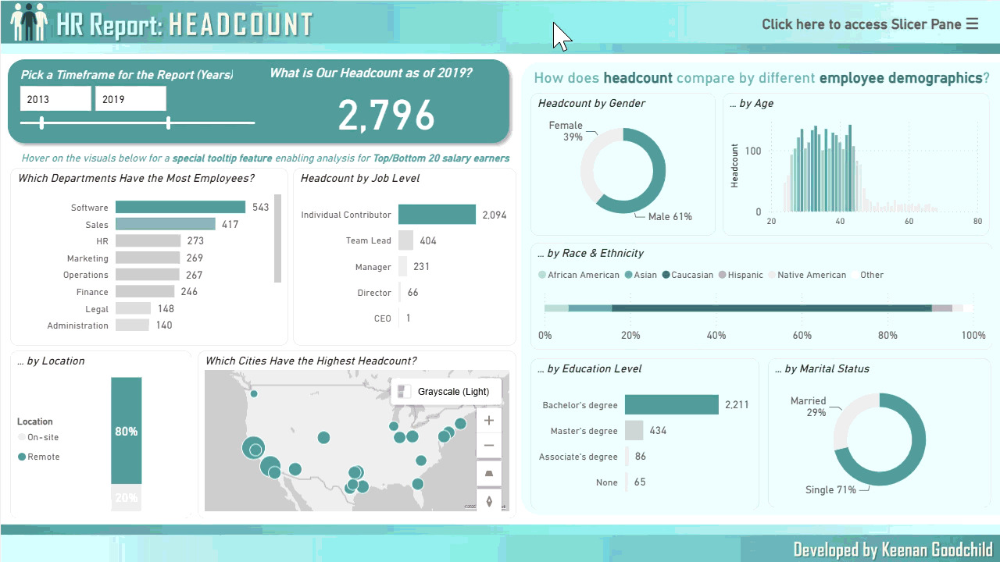
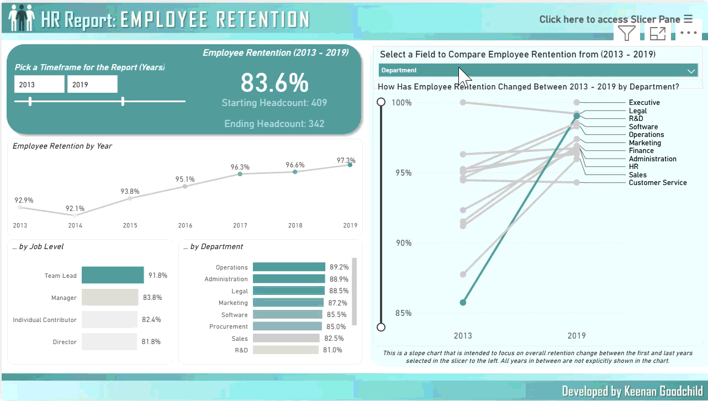
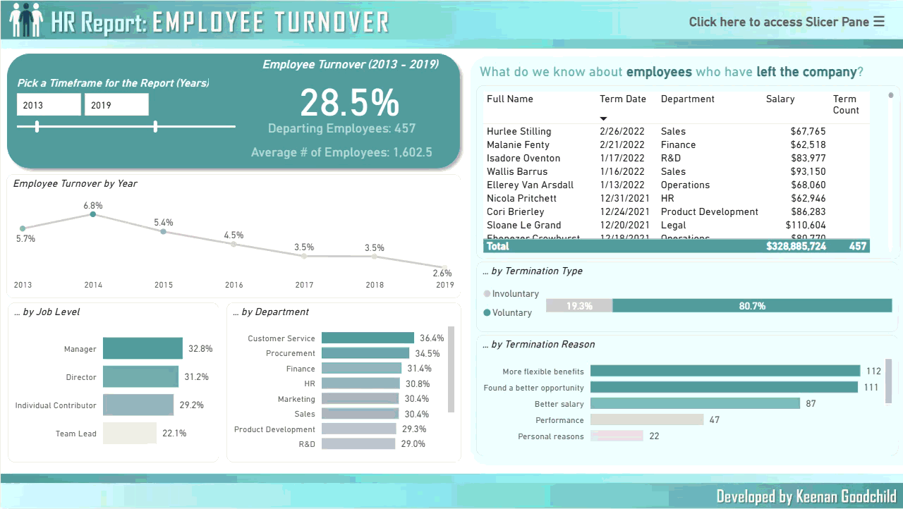
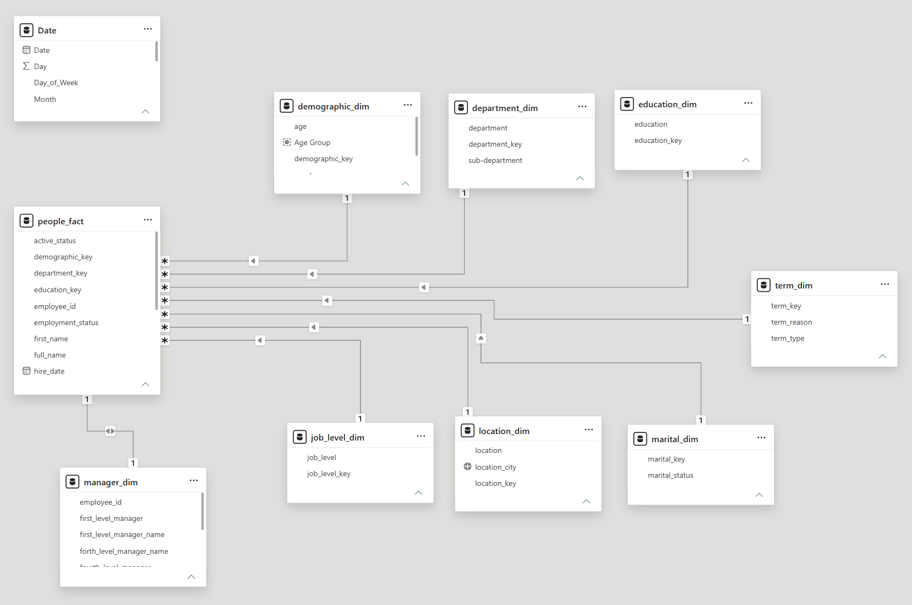

# HR Analysis Report

## 🛠 Tools Used  

## 💡 Skills Demonstrated  

---

---

## 📊 Description  

This **professional Power BI tool** provides a variety of pages developed for a Human Resources department to help evaluate the company's employee headcount, retention, and turnover, broken down by a variety of metrics like department, job level, employee demographics, and more.

This tool utilizes a **self-service design philosophy**, built with user-friendly web-design principles that turns end-users from passive data viewers into **active, independent data investigators**. The company's logo, color palette, and visual design were created from scratch for this project.

 The tool is designed with multiple pages:  
 - **Overall Features**
   - Cross-filtering capabilities
   - Slicer Pane
   - Time Frame slicer
 - **Headcount Page** → An overview of current headcount, with breakdowns by department, job level, and employee demographics, as well as additional information through tooltips.
 - **Retention Page** → Evaluates employee retention by year, job level, and department, including a slope chart that focuses on overall retention change.
 - **Turnover Page** → Evaluates employee turnover by year, job level, and department, including information about the employees who left the company and why.

  🔗 [Click here to interact with the published project →](https://app.powerbi.com/view?r=eyJrIjoiM2ZmNTU0MDYtYTlmYS00MDgwLWE5MmItZGQwZGMyOGIyZmYyIiwidCI6IjZmODFlZjFkLTlmYmQtNGMwYi05OGVkLWJhNWQ1MzA5YzQzMCJ9)
 

> *This tool was designed for skill demonstration purposes, without the assistance of AI, and features fictitious data.*  
> *This tool was created in August 2026.*

---

## 📸 Preview  

### Headcount Page

### Retention Page

### Turnover Page

---

## 📁 Data Model Structure

---

## 👩‍💻 Created By  

**Keenan Goodchild**  
- 📊 Microsoft Certified Excel Expert & Power BI Data Analyst Associate | PCEP Certified Entry-Level Python Programmer
- 🌐 [Check out my LinkedIn Profile](https://www.linkedin.com/in/keenan-goodchild/)  
- 💼 Open to opportunities in **business intelligence, data analytics, and other data-related fields**

[Head Back to the Power BI Portfolio](https://github.com/KGGoodchild/PowerBI-Portfolio)
