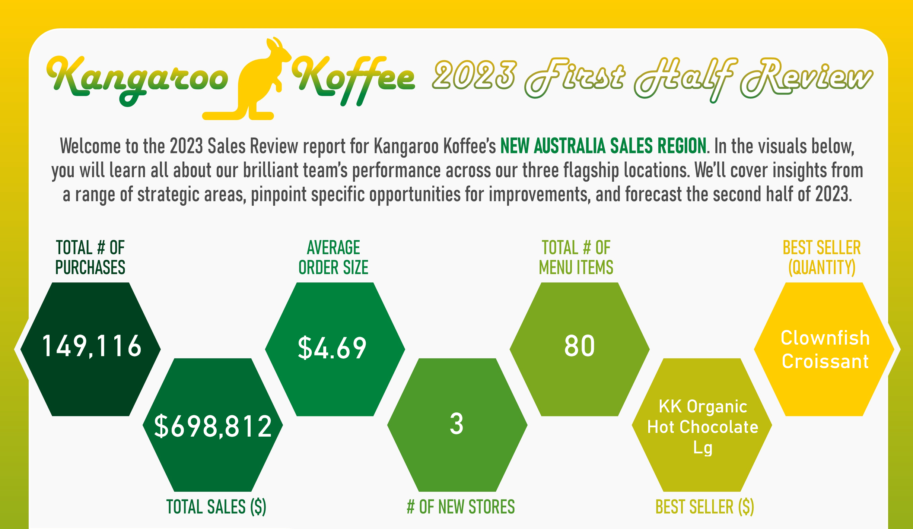

# Power BI Portfolio  

## 🏫 Certifications

## 🛠 Tools  

<!-- Comment Block

 -->

---

## 💡 Skills  

<!-- Comment Block

  
 -->
---

Welcome to my Power BI Portfolio Repository! This collection highlights business intelligence tools, dashboards, and infographics that I’ve built to demonstrate my abilities to transform complex raw data into actionable insights. Each project reflects my expertise in data modeling, data visualization and design, and data storytelling. My goal is to create tools that help businesses make smarter, data-driven decisions.  

---

# [Project 1: Austin,TX Real Estate Insights Tool](Austin_Housing_Tool) 

  

    
Click here for additional details about the tool!
 
  
This **professional Power BI tool** provides a variety of views to help the consumer evaluate 2020 property listings in the Austin, TX area, based on location, nearby schools, property features, and a plethora of other metrics. The company's logo, color palette, and visual design were created from scratch for this project.

 The tool is designed with multiple views:
 - **Overall Features**
   - Cross-filtering capabilities
   - Slicer panel
   - View navigation buttons
 - **Summary View** → An overview of properties available in Austin, TX, including metrics for pricing, living area size, and lot size.
 - **Location View** → An interactive map that lets you filter properties and hover over them to get additional information through tooltips.
 - **School View** → A view of nearby schools and find communities in the area that fit specific education preferences.
 - **Features View** → Uncover more information about the trends in Austin housing to surface what home features are driving current prices in the area.

This tool utilizes a **self-service design philosophy**, built with user-friendly web-design principles that turns end-users from passive data viewers into **active, independent data investigators**.
  
  🔗 [Click here to view the full project details →](Austin_Housing_Tool)

> *This tool was designed for skill demonstration purposes, without the assistance of AI, and features publicly available data from 2020.*  
> *This tool was created in July 2026.*

  

---

# [Project 2: Kangaroo Koffee Sales Infographic](Coffee_Sales_Infographic)  

  
  

    
Click here for additional details about the infographic!
 
   
This **professional Power BI infographic** provides a Q1/Q2 2023 high-level performance review of a coffee company's new sales region, covering insights from a range of strategic areas, pinpointing specific opportunities for improvements, and forecasting the remainder of 2023. The company's logo, color palette, and visual design were created from scratch for this project.

 This infographic is designed with summary metrics and three main segments:
 - **Insights** → Finds insights gained from sales across different product categories and which products drive revenue.
 - **Improvement Opportunities** → Looks at the revenue across time of day and day of the week to find a potential area for improvement.
 - **Forecast for Second Half 2023** → Sets a conservative sales goal and forecasts the second half of 2023, and gives a stretch goal based on Q2 growth.

🔗 [Click here to view the full project details →](Coffee_Sales_Infographic)

> *This infographic was designed for skill demonstration purposes, without the assistance of AI, and features a mock scenario using fictitious data.*  
> *This tool was created in July 2026.*

  

---

# [Project 3: Grocery Market Research Report](Grocery_Market_Research)  

  
  

    
Click here for additional details about about the report!
 

This **professional Power BI report** provides marketing research metrics that surfaces insights into a retail grocer's six most recent marketing campaigns, including a look at their customer's demographic information and specific key purchase drivers. The company's logo, color palette, and visual design were created from scratch for this project.

 This report is designed with three main focuses:
 - **Campaign Performance** → Metrics that look into the performance of the company's products and the six most recent marketing campaigns.
 - **Customer Demographics** → A deep dive into who are customers are, including education, martial status, salary, age, and more.
 - **Purchase Drivers** → Identifying what drives campaign performance and customer decision-making.

🔗 [Click here to view the full project details →](Grocery_Market_Research)  

> *This report was designed for skill demonstration purposes, without the assistance of AI, and features a mock scenario using fictitious data.*  
> *This tool was created in July 2026.*

  

  
---

<!-- Comment Block

# [Project 4: Healthcare Dashboard](Healthcare_Dashboard)  

  

This **interactive Power BI dashboard** was developed for healthcare laboratory performance monitoring. It highlights **compliance rates, turnaround times, test volumes, and critical vs non-critical test counts** across departments.  

What makes this project unique is that it was also taught as a **step-by-step Power BI tutorial on YouTube**, showcasing not just my dashboard development skills but also my role as a **Power BI instructor**.  

The dashboard is designed with multiple views:  
- **KPI Cards** → Average Compliance Rate, Average Turnaround Time.  
- **Department Analysis** → Critical vs Non-Critical tests, test volumes.  
- **Distribution View** → Turnaround time distribution by time buckets.  

🔗 [Click here to view the full project details →](Healthcare_Dashboard)  

👉 Watch the full tutorial here: [Healthcare Dashboard Power BI Tutorial](https://www.youtube.com/watch?v=o4mUfLXUQ5A&t=424s)  

---

 -->
